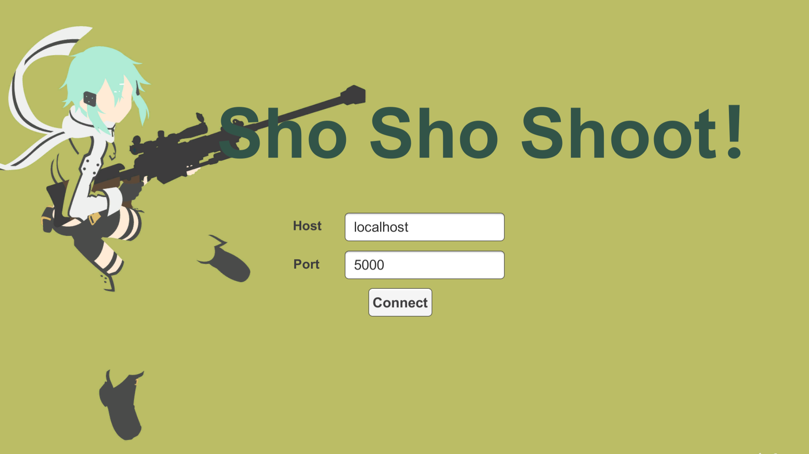
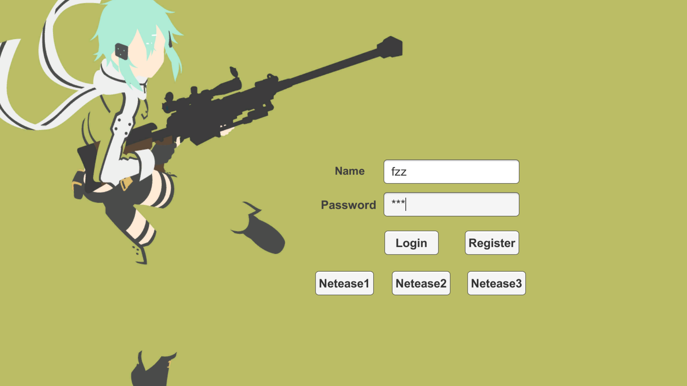
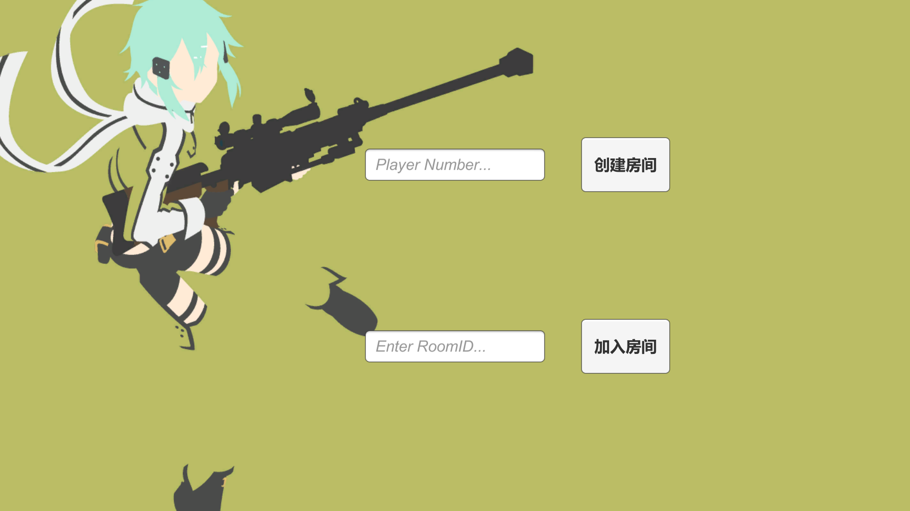
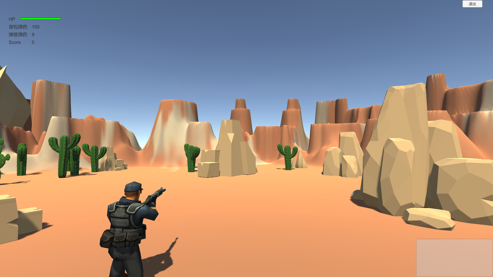

# tps-online-unity
A TPS online game with Unity3D

### 运行

#### 服务端

python2.7 windows执行server.bat

#### 客户端

直接运行client.bat或者unity运行welcome场景

### 玩法说明

#### 1 连接服务器

输入服务端IP和端口，点击`connect`

#### 2 登录注册或者内置账号进入游戏主页 

输入用户名和密码注册和登录，或者点击`netease`系列按钮登录 

#### 3 游戏主页

可以输入游戏人数（如 2） `创建房间`，进入房间后可以`Exit`退出房间，也可以等待其他玩家进来，`Start`开始游戏。房间人数不足时，由AI补全。

游戏主页也可以输入房间号（如1003）`加入房间`，只有当房间合法时才可以成功加入。

创建房间的玩家为房主，仅房主可以开始游戏

#### 4 游戏界面

左上角为人物信息模块，展示血量 `hp` ，`背包弹药` ，`弹夹弹药` ，`Score` 

右上角为`退出` ，可以随时退出房间

右下角为游戏内玩家得分公告

中心设有准星

玩家血量为零 则游戏结束，需退出房间

### 游戏指令/按键

#### 移动

`W`  `A`  `S`  `D`  或者方向键控制前后左右

鼠标右键控制射击，鼠标移动控制视角，人的朝向和准星

`space` 控制 跳跃  

